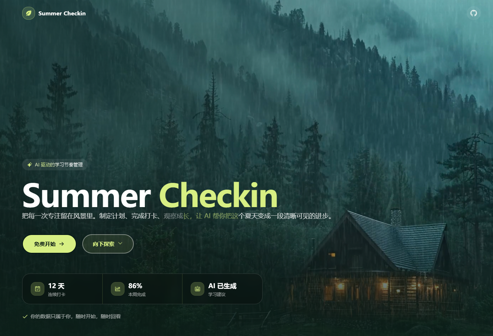

<h1 align="center">
  <span style="color:#ffffff;">Summer</span>
  <span style="color:#d7ef83;">Checkin</span>
</h1>

<p align="center">
  🌱 让每一次专注，都留下生长的痕迹
</p>

<p align="center">
  <strong>全栈学习成长平台</strong> · 小岛打卡 · 计划 · 专注 · AI 智能体 · 知识库 · 聊天室
</p>

<p align="center">


</p>

<p align="center">
  <a href="#-功能亮点">功能亮点</a> ·
  <a href="#-截图">截图</a> ·
  <a href="#-功能总览">功能总览</a> ·
  <a href="#-快速开始">快速开始</a> ·
  <a href="#-部署docker">部署</a> ·
  <a href="#-常见问题">FAQ</a> ·
  <a href="#-路线图">路线图</a>
</p>

---

## ✨ 功能亮点

| 亮点 | 说明 |
|---|---|
| 🏝️ **学习小岛打卡** | 每日打卡签到，3D 学习岛屿随累计时长成长，连续天数 + 年度热力图实时更新 |
| 🤖 **AI 原生智能体** | 分析学习数据生成个性化计划、文档自动拆任务、长期记忆、每周学习报告 |
| 📚 **知识库 RAG** | 上传 md / pdf / docx / txt，向量检索后基于你的文档回答 |
| 💬 **实时聊天室** | WebSocket 群聊，支持引用回复，`@AI` 唤起 AI 伙伴流式回复（Markdown / 代码高亮）|
| 🌿 **多场景主题 + 环境音** | 雨林 / 雪日 / 暖云一键换肤，自动配对应环境音，离开站点自动静音 |
| 📊 **个人统计主页** | 专注时长趋势、年度打卡热力图、最佳科目，进步一目了然 |

## 📸 截图

<p align="center">
  
  <br/>
  <em>产品进入页 · 多场景主题，切换场景整页换色</em>
</p>

## 🧩 功能总览

> 主导航：**小岛** · **计划** · **阅读** · **主页**（个人统计），全局入口含聊天室、智能体、通知铃、音量与环境音。

### 🏝️ 小岛（每日打卡）
- 进入 3D 学习小岛，点按钮记录今日打卡与心情；场景随氛围切换
- 连续打卡天数、最长连续、累计时长驱动岛屿成长
- 年度日历热力图，坚持足迹一目了然

### 📋 计划与任务
- 任务制进度：`已完成任务 / 总任务`，计划、任务、打卡三方联动
- **文档工作室**：Markdown 撰写计划文档，AI 按文档自动拆分任务
- **今日待办**：独立待办清单，AI 智能体可直接增删改查

### 🍅 专注与沉浸
- 番茄钟专注（可自定义时长，默认 25+5），完成自动写入学习记录
- 沉浸模式：全屏无干扰界面，时间 / 鼓励语纯净展示
- 专注时长趋势、日均学习等数据进入个人统计主页

### 🤖 AI 智能体
- 学习计划工作流：先分析学习数据，再生成个性化计划（关键步骤请求确认）
- 文档自动拆解为任务，知识库向量检索 + 基于文档回答
- 长期记忆：AI 自动提取用户偏好注入上下文
- 通知中心：每日总结、每周报告、进度提醒（每日去重）

### 💬 多人聊天室
- WebSocket 实时群聊：所有在线用户共享一条消息流，在线人数实时广播
- **引用回复**：对任意消息回复，对方收到「某某某回复了你」的滚动感知提醒
- `@AI` 唤起 AI 伙伴流式回复，内置「温柔宝」「嘴欠宝」两种人格，支持 Markdown 与代码高亮
- 独立 WebSocket sidecar 进程承载，握手期 Cookie 鉴权，心跳保活 + 断线清理
- AI 以虚拟用户身份入群，读取最近群聊上下文后流式回推，模型池 LOW 档自动降级并做 token 记账 / 限流

### 👤 账号与头像
- Better Auth 注册 / 登录 / 会话管理
- 头像阿里云 OSS 预签名直传，**历史头像可一键回滚**

### ✨ 其他体验
- 雨林 / 雪日 / 暖云三场景，整页配色 + 对应环境音（雨声 / 雪声）
- 首次使用新手引导，带游标逐步介绍核心入口
- 连续操作体验打磨：沉浸聚焦、场景切换动效、3D 岛屿

## 🛠 技术栈

| 层 | 技术 |
|---|---|
| 前端 | Next.js 16（App Router）、React 19、TypeScript、Tailwind CSS v4 |
| 3D / 动效 | Three.js（react-three-fiber）、GSAP、Motion（按需动态加载）|
| 后端 | Next.js API Routes、AI SDK、Prisma ORM |
| 数据库 | PostgreSQL 16 + pgvector（向量检索）、Prisma |
| AI | OpenAI 兼容 API，**模型池**多模型可配（默认 Agnes 中国站，Embedding 走阿里百炼）|
| 实时 | WebSocket（`ws`）独立 sidecar 进程 |
| 文件存储 | 阿里云 OSS（头像预签名直传）|
| 可视化 | 自绘热力图 / 统计条（无第三方图表库）|

## 🏗 架构概览

```
浏览器
  │
  ├─ HTTP/HTTPS ──► Nginx（反向代理）
  │                    ├─ /            → Next.js 应用（:3000）
  │                    └─ /ws          → WebSocket sidecar（:3001）
  │
  ├─ 头像上传 ──► 阿里云 OSS（预签名直传，不经应用服务器）
  │
  └─ WebSocket ─────► server/index.ts（聊天室 + AI 流式回复）
                         │
                         └─ Prisma ──► PostgreSQL 16 + pgvector
```

- **Next.js 应用**：页面、API、AI 智能体、知识库
- **WebSocket sidecar**（`server/`）：独立进程，承载多人聊天室与 AI 流式回复
- **PostgreSQL**：主数据 + pgvector 向量检索（文档分块 / 用户记忆）
- **OSS**：头像对象存储，浏览器直传，应用只签发预签名 URL

## 🚀 快速开始

### 环境要求

| 依赖 | 版本 |
|---|---|
| Node.js | 18+ |
| PostgreSQL | 16（建议 `pgvector/pgvector` 镜像，向量检索需要 pgvector 扩展）|

### 本地开发

```bash
# 1. 安装依赖
npm install

# 2. 配置环境变量
cp .env.example .env   # 填入真实 API Key 与数据库地址

# 3. 生成 Prisma Client
npx prisma generate

# 4. 初始化数据库（建表 + 写入引导模板等种子数据）
npx prisma db push
npx prisma db seed

# 5. 启动（两个进程）
npm run dev        # Next.js 前端（:3000）
npm run ws:dev     # WebSocket sidecar（:3001，聊天室 + AI 依赖它）
```

> **数据库升级**：本项目使用手写 SQL 迁移，见 `prisma/*.sql`，已有数据库按需执行对应文件。

## 🔑 环境变量

| 变量 | 说明 |
|---|---|
| `DATABASE_URL` | PostgreSQL 连接串 |
| `AGNES_API_KEY` / `DASHSCOPE_API_KEY` | AI 对话 API Key（OpenAI 兼容；模型池优先读 `AGNES_*`，`DASHSCOPE_*` 兼容旧配置）|
| `AGNES_BASE_URL` / `DASHSCOPE_BASE_URL` | 对话 API 地址（默认 `https://api.agnes-ai.cn/v1` 中国站）|
| `DASHSCOPE_MODEL` | 对话模型（默认 `agnes-2.5-flash`）|
| `EMBEDDING_API_KEY` / `MODEL` / `BASE_URL` | 向量模型（默认阿里百炼）|
| `AI_TOKEN_LIMIT` | 每用户每日 token 上限（0 = 不限，默认 200000）|
| `BETTER_AUTH_SECRET` | 会话签名密钥（`openssl rand -base64 32`）|
| `BETTER_AUTH_URL` | 登录回调地址（部署时 = 公网访问地址，不带端口）|
| `NEXT_SERVER_ACTIONS_ENCRYPTION_KEY` | Server Actions 加密密钥（`openssl rand -hex 32`）|
| `OSS_ACCESS_KEY_ID` / `SECRET` | 阿里云 OSS 凭证（头像直传）|
| `OSS_BUCKET` / `REGION` / `PUBLIC_BASE_URL` | OSS Bucket 配置 |
| `CRON_SECRET` | agent 定时接口 Bearer 鉴权（服务器本地维护，勿整包覆盖 .env）|

## 📁 项目结构

```
├── src/
│   ├── app/                 # App Router 页面与 API 路由
│   │   ├── (auth)/          # 登录 / 注册
│   │   ├── (dashboard)/     # 小岛 / 计划 / 阅读 / 统计主页
│   │   ├── agent/           # AI 智能体页
│   │   └── api/             # 后端接口（chat / ai / knowledge / plans…）
│   ├── components/          # UI 组件（聊天室 / 专注室 / 智能体 / 统计 / 岛屿…）
│   ├── lib/                 # 业务逻辑、AI 工具、RAG 检索、记忆、用量
│   ├── context/             # 全局状态（场景 / 引导）
│   └── styles/ types/       # 全局样式、共享类型
├── server/                  # WebSocket sidecar（聊天室 + AI 流式回复）
├── prisma/                  # Schema、种子数据、SQL 迁移
├── scripts/                 # 部署、文档提取、重置密码等工具
└── nginx/                   # 反向代理配置
```

## 🧰 内置脚本工具

| 脚本 | 用途 |
|---|---|
| `scripts/reset-password.ts` | 管理员重置用户密码（scrypt 与 Better Auth 兼容）|
| `scripts/extract_pdf.py` / `extract_docx.py` | 知识库 PDF / Word 文本提取 |
| `scripts/deploy.sh` | Docker 镜像构建与上传部署 |
| `scripts/server-setup.sh` | 新服务器初始化（装 Docker / 开端口）|

## 🗄 数据模型

27 张表，按模块分组：

| 模块 | 表 |
|---|---|
| 用户与认证 | `user` · `session` · `account` · `avatarchange`（头像历史）|
| 学习核心 | `plan` · `plantask` · `todo` · `checkin` · `studyrecord` |
| AI 智能体 | `agentrun` · `agentstep` · `agentapproval` · `agentdecision` · `agenttoolcall` · `usermemory` · `aihistory` · `conversation` · `conversationmessage` · `agentschedule` |
| 聊天室 | `chatmessage` |
| 知识库 / 文档 | `document` · `documentchunk` · `knowledgedoc` · `plantemplate` · `documenttemplate` |
| 其他 | `notification` · `tokenusage` |

> 完整字段见 `prisma/schema.prisma`。

## 🐳 部署（Docker）

```bash
# 一键部署（前端 + WebSocket + PostgreSQL + Nginx）
docker compose up -d --build
```

- 需提供 AI 对话、Embedding、Better Auth、OSS 等环境变量（见上文表格）
- `BETTER_AUTH_URL` 设置为服务器的公网地址（不含端口，走 Nginx 80）
- 首次部署后需初始化数据库：`prisma db push` + `prisma db seed`
- 生产环境注意：修改 `docker-compose.yml` 中 PostgreSQL 默认密码；容器内置 Python 用于 PDF / Word 文本提取

## ❓ 常见问题

**忘记密码了怎么办？**
管理员用 `scripts/reset-password.ts` 重置，无需邮件服务，几秒搞定。

**为什么数据库里密码是一串看不懂的字符？**
那是 scrypt 密码哈希（`盐:哈希`），不是明文。密码不可逆，泄露数据库也推不出原密码——这是安全设计。

**纯 HTTP 访问时聊天室发不出消息？**
`crypto.randomUUID()` 只在 HTTPS / localhost（安全上下文）可用，代码已做兜底。长期建议上 HTTPS。

**知识库上传 PDF / Word 报"文本提取失败"？**
容器内置了 Python + PyPDF2 + python-docx，确认部署的镜像包含这些依赖。

## 🗺 路线图

- [ ] HTTPS 上线（需配置域名 + Let's Encrypt 证书）
- [ ] 忘记密码自助流程（邮件链接重置，需接入 SMTP）
- [ ] 数据库定期自动备份
- [ ] 更多场景主题与专属环境音

## 🙏 致谢

- [Next.js](https://nextjs.org) · [React](https://react.dev) · [Tailwind CSS](https://tailwindcss.com)
- [Prisma](https://www.prisma.io) · [PostgreSQL](https://www.postgresql.org) · [pgvector](https://github.com/pgvector/pgvector)
- [Better Auth](https://better-auth.com) · [AI SDK](https://ai-sdk.dev) · [Three.js](https://threejs.org) · [Motion](https://motion.dev)

## 📄 License

[MIT](./LICENSE)
